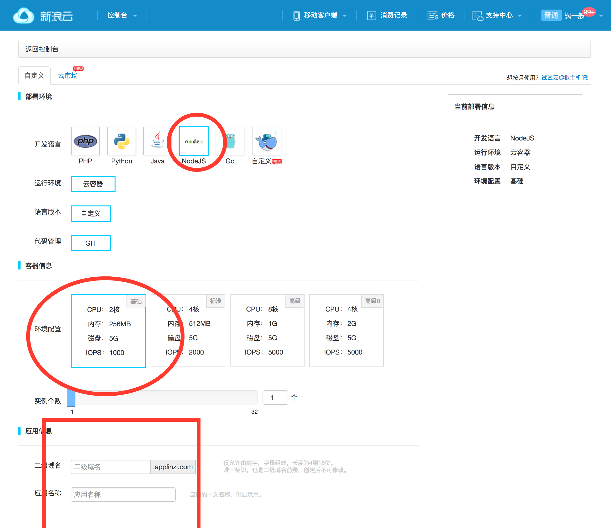
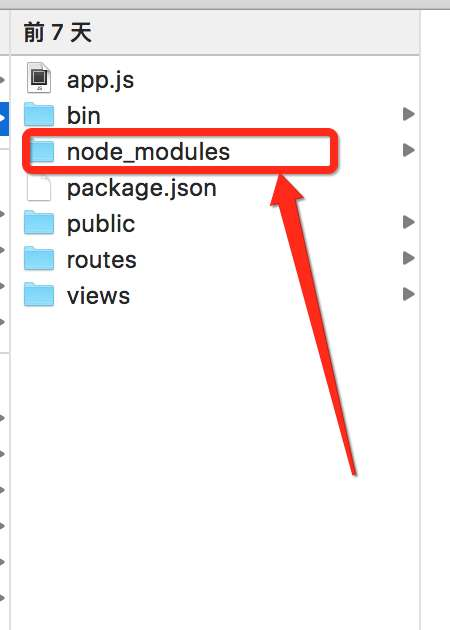

#Sae部署Node

1. 使用新浪微博帐号登录Sae
2. 实名认证（这里就不作步骤解释了）<a href="http://www.sinacloud.com/ucenter/realshow.html?from=sidebar">登录成功后点我就行</a>
3. 创建新应用,进入如下页面,选择node.js,按照需要购买，保存就行了
</img>
4. 在你想要的地方创建一个目录，并将你编写好的node.js代码丢进这个空的目录中，但是请务必去掉 `node_modules` 这个文件夹。
</img>
5. 然后在控制台键入如下代码：

```bash
cd 你的第一次建好文件夹
git init
git add .
git commit -m "init project"
git remote add sae https://git.sinacloud.com/gzcsnet
###接下来你要输入 用户名
### 您的安全密码

git push sae master:1

``